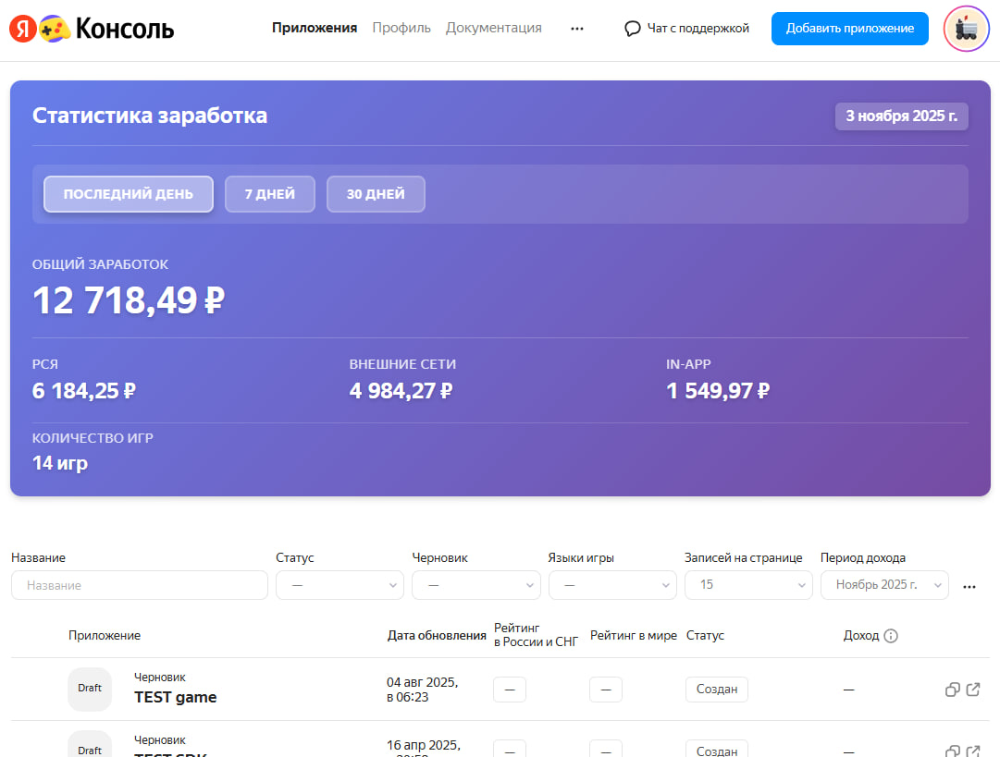

# Y-Stats-Extension (Unofficial)

Неофициальное расширение для разработчиков Яндекс Игр.

---



---

### ⚠️ DISCLAIMER / ОТКАЗ ОТ ОТВЕТСТВЕННОСТИ

> **[EN]** This project is an independent open-source tool and is **not affiliated, associated, authorized, endorsed by, or in any way officially connected with Yandex** or any of its subsidiaries. Use at your own risk.
>
> **[RU]** Этот проект является независимой разработкой с открытым исходным кодом. Он **не связан, не авторизован и не поддерживается компанией Яндекс** или её дочерними структурами. Используйте на свой страх и риск.

---

## Описание
Браузерное расширение, которое встраивается в консоль разработчика Яндекс Игр и показывает подробную статистику доходов, которой нет в стандартном интерфейсе.

### ✨ Возможности
* **Детальный доход:** Подсчет заработка по всем играм сразу на одной странице.
* **Разбивка источников:** Показывает, сколько принесла РСЯ, внешние сети и внутриигровые покупки (In-app).
* **Гибкие периоды:** Можно выбрать конкретную дату или произвольный период.
* **Удобная таблица:** Сортировка игр по доходу, показам и быстрые ссылки на редактирование черновиков.

## 🔒 Конфиденциальность и безопасность
* **Локальная работа:** Весь код выполняется **локально** в вашем браузере.
* **Никакого сбора данных:** Расширение **не отправляет** ваши токены, куки или статистику на сторонние серверы. Все запросы идут только к официальному API `games.yandex.ru` от вашего лица.
* **Открытый код:** Исходный код полностью открыт. Вы можете проверить его перед установкой, чтобы убедиться в безопасности.

## 🛠 Установка

Проект не требует сборки. Просто скачайте код.

1.  Скачайте этот репозиторий: **Code -> Download ZIP** (и распакуйте архив) или склонируйте через git.
2.  Откройте в браузере адрес управления расширениями (например `chrome://extensions/`).
3.  В правом верхнем углу включите **переключатель** «Режим разработчика» (Developer mode).
4.  Нажмите кнопку **«Загрузить распакованное»** (Load unpacked).
5.  Выберите папку `Y-Stats-Extension`.

## 🚀 Как пользоваться

1.  Зайдите в консоль разработчика: [games.yandex.ru/console/applications](https://games.yandex.ru/console/applications).
2.  Дождитесь, пока над списком игр появится новый блок **«Статистика заработка»**.
3.  Нажмите кнопку **«Загрузить статистику»**.
4.  Дождитесь окончания загрузки (зеленый прогресс-бар).
5.  Изучайте данные! Вы можете менять даты и переключать вкладки.

## ℹ️ Важная информация
Так как расширение использует приватные API (Private Endpoints):
* Инструмент может временно перестать работать, если платформа обновит дизайн или структуру консоли.
* При большом количестве игр загрузка может занять некоторое время из-за ограничений браузера на частоту запросов.

---

## 📦 Зависимости

Проект использует следующие сторонние библиотеки:

| Библиотека | Версия | Лицензия | Описание |
|------------|--------|----------|----------|
| [Chart.js](https://www.chartjs.org/) | 4.5.1 | MIT | Библиотека для построения графиков |

<details>
<summary>Проверка подлинности библиотек</summary>

Файлы можно проверить, сравнив SHA256-хеш с официальным источником:

```bash
# Проверить локальный файл
sha256sum lib/chart.umd.js

# Сравнить с официальным CDN
curl -s "https://cdn.jsdelivr.net/npm/chart.js@4.5.1/dist/chart.umd.js" | sha256sum
```

Ожидаемый хеш для `chart.umd.js` v4.5.1:
```
ecc3cd1eeb8c34d2178e3f59fd63ec5a3d84358c11730af0b9958dc886d7652a
```

</details>

---

### Лицензия
Код распространяется под лицензией MIT. Подробнее см. файл `LICENSE`.

---
**WebGameAnalytics**
Больше аналитики и данных по рынку: [game-analytics.ru](https://game-analytics.ru/)
